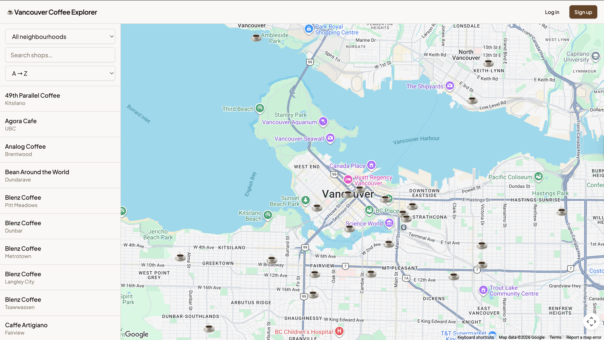
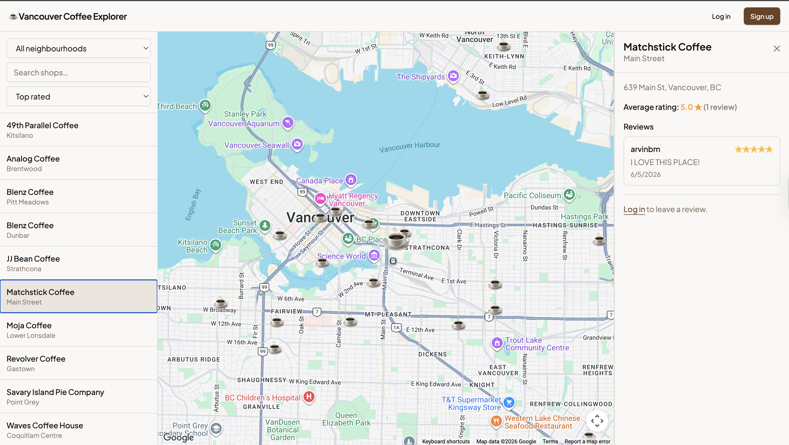
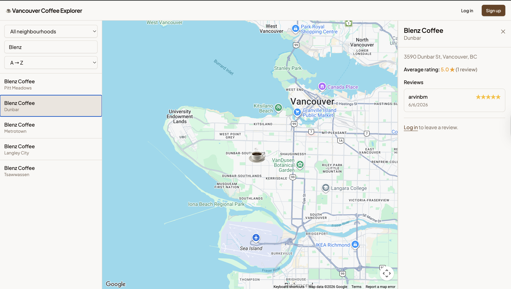
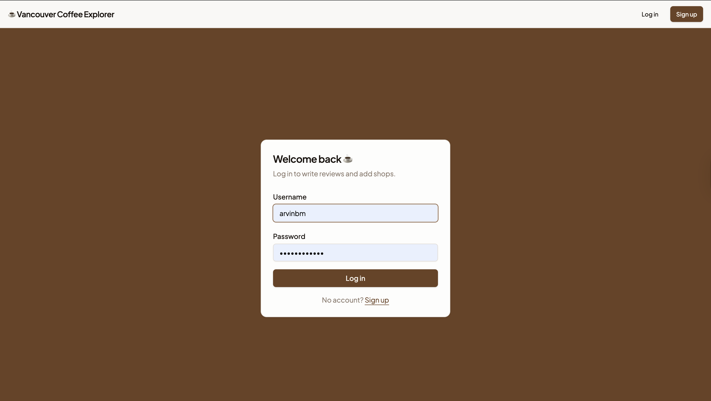

# ☕ Vancouver Coffee Explorer

A full-stack web app to discover, filter, and review coffee shops across Vancouver and the Lower Mainland on an interactive map.

> Built as a learning project to demonstrate a production-grade stack: React + TypeScript on the front end, Node.js/Express on the back end, PostgreSQL as the database — all containerised with Docker Compose.

---

## Demo

| Map & markers | Shop detail + reviews | Search & sort | Login |
|---|---|---|---|
|  |  |  |  |

---

## Features

- **Interactive map** — ☕ emoji markers for every shop; hover to see its name and rating; click to open the detail panel; selected marker animates to 1.75×
- **Sidebar shop list** — hover a row to pan the map to that location and preview its details; click to lock the selection and scroll the sidebar to it
- **Live search** — filters both the sidebar list and map markers as you type
- **Sort** — order by A → Z, top rated, or most reviewed
- **Neighbourhood filter** — 50 neighbourhoods across Vancouver, Burnaby, North/West Van, Surrey, Richmond, Coquitlam, and more
- **Animated detail panel** — slides in from the right with a smooth width transition
- **Reviews** — star ratings (1–5) + optional comment; average shown in sidebar, map tooltip, and detail panel
- **Delete your own review** — trash icon on reviews you wrote; ratings update instantly
- **Auth** — JWT-based sign-up / login; protected routes for writing reviews and adding shops
- **Add a shop** — authenticated users submit via Google Places Autocomplete
- **Toast notifications** — warm brown success/error toasts on every action

---

## Stack

| Layer | Technology |
|---|---|
| Frontend | React 18 · TypeScript · Vite |
| Styling | Tailwind CSS · shadcn/ui · Plus Jakarta Sans |
| Maps | Google Maps JS API · `@react-google-maps/api` |
| Backend | Node.js · Express · TypeScript |
| Database | PostgreSQL 16 |
| Auth | JWT · bcrypt |
| Dev environment | Docker Compose |

---

## Project Structure

```
Vancouver_Coffee_Shop_Explorer/
├── docker-compose.yml
├── .env.example                    ← copy to .env and fill in keys
├── db/
│   ├── 001_init.sql                ← schema: users, coffee_shops, neighborhoods, reviews
│   ├── 002_seed_neighborhoods.sql
│   └── 003_seed.sql                ← 50 neighbourhoods + 50 seed coffee shops
├── backend/
│   ├── Dockerfile                  ← two-stage build (compile TS → run JS)
│   └── src/
│       ├── index.ts
│       ├── db/index.ts             ← shared pg connection pool
│       ├── middleware/auth.ts      ← JWT authenticate middleware
│       └── routes/
│           ├── index.ts            ← mounts all routers
│           ├── auth.ts             ← POST /auth/signup  POST /auth/login
│           ├── shops.ts            ← GET/POST /shops   GET /shops/:id
│           ├── reviews.ts          ← GET/POST/DELETE /shops/:id/reviews
│           └── neighborhoods.ts    ← GET /neighborhoods
└── frontend/
    ├── Dockerfile
    ├── vite.config.ts              ← /api proxy → backend:4000
    └── src/
        ├── api/                    ← axios client + typed helpers (shops, reviews, auth)
        ├── components/             ← Navbar, ShopDetail, ReviewForm, AddShopForm
        ├── components/ui/          ← shadcn/ui primitives (Button, Input, Card …)
        ├── context/AuthContext.tsx ← JWT state via React Context
        └── pages/                  ← MapPage, LoginPage, SignupPage
```

---

## Getting Started

### Prerequisites

- [Docker Desktop](https://www.docker.com/products/docker-desktop/) — Node and Postgres run inside containers.
- A [Google Maps API key](https://console.cloud.google.com/) with **Maps JavaScript API** and **Places API** enabled.

### 1 — Clone & configure

```bash
git clone https://github.com/arvinbm/Vancouver_Coffee_Shop_Explorer.git
cd Vancouver_Coffee_Shop_Explorer
cp .env.example .env
```

Edit `.env`:

```env
VITE_GOOGLE_MAPS_API_KEY=your_google_maps_key
JWT_SECRET=any_long_random_string
```

### 2 — Start

```bash
docker compose up --build
```

| Service | URL |
|---|---|
| App | http://localhost:5173 |
| API | http://localhost:4000 |
| Health check | http://localhost:4000/api/health |
| Postgres (host) | localhost:5433 |

The database schema and seed data load automatically on first start.

### 3 — Create an account

Visit **http://localhost:5173/signup**, register, and you can immediately write reviews and add new coffee shops.

---

## API Reference

| Method | Endpoint | Auth | Description |
|---|---|---|---|
| `POST` | `/api/auth/signup` | — | Register a new user |
| `POST` | `/api/auth/login` | — | Login, returns JWT |
| `GET` | `/api/shops` | — | List shops (optional `?neighborhood_id=`) |
| `GET` | `/api/shops/:id` | — | Single shop with avg rating + review count |
| `POST` | `/api/shops` | ✓ | Add a new shop |
| `GET` | `/api/shops/:id/reviews` | — | List reviews for a shop |
| `POST` | `/api/shops/:id/reviews` | ✓ | Submit a review (one per user per shop) |
| `DELETE` | `/api/shops/:id/reviews/:reviewId` | ✓ owner | Delete your own review |
| `GET` | `/api/neighborhoods` | — | List all neighbourhoods |
| `GET` | `/api/health` | — | Server + DB health check |

---

## Useful Commands

```bash
# Rebuild just the backend after a code change
docker compose up -d --build backend

# Open a Postgres shell
docker compose exec postgres psql -U postgres -d coffee_explorer

# Stop everything (data kept)
docker compose down

# Stop and wipe the database
docker compose down -v
```

---

## How the pieces connect

```
Browser  (port 5173)
  │  /api/* requests
  ▼
Vite dev server  (proxy)
  │  forwards to backend:4000
  ▼
Express API  (port 4000)
  │  SQL via pg Pool
  ▼
PostgreSQL  (5432 inside Docker · 5433 on host)
```

The Vite proxy means the browser only ever talks to `localhost:5173` — no CORS issues in development. In production, Nginx or a cloud load balancer handles the same routing.
